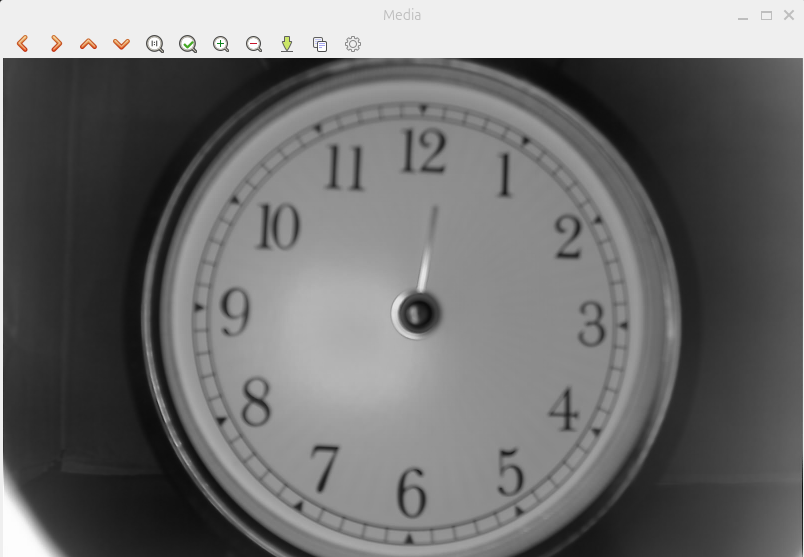
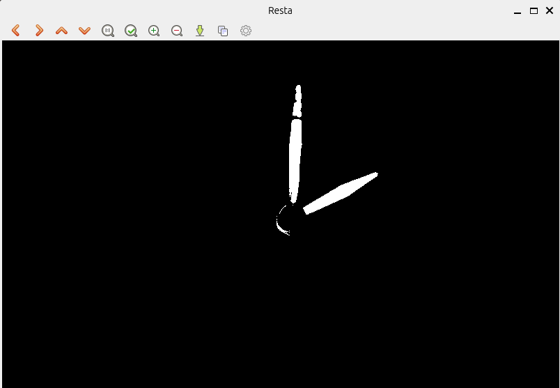
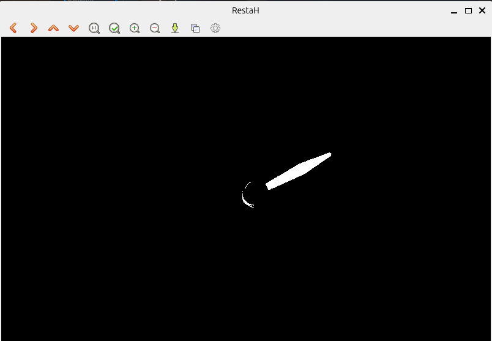

# Vision-Based Clock Reader

Este proyecto implementa un algoritmo de visión por computadora para leer la hora de un reloj analógico a partir de imágenes, utilizando procesamiento de imágenes básico con OpenCV.

## Descripción del Algoritmo

El sistema sigue un proceso de varios pasos para aislar las manecillas del reloj y determinar su posición angular.

### 1. Cálculo del Promedio (Media)
Para poder identificar qué partes de la imagen son las manecillas, primero necesitamos saber cómo se ve el reloj vacío. El algoritmo carga una base de datos de imágenes de relojes y calcula el promedio de cada píxel. 

Como las manecillas se mueven en cada imagen, al promediarlas "desaparecen", dejando una imagen limpia del fondo del reloj.



### 2. Resta y Umbralización
Una vez que tenemos el fondo promedio, tomamos la imagen de entrada que queremos leer y le restamos el fondo.
- Los píxeles que son iguales en ambas imágenes (el fondo) resultan en cero.
- Los píxeles donde están las manecillas tendrán una diferencia significativa.

Aplicamos un **umbral (threshold)** para convertir esta diferencia en una imagen binaria (blanco y negro), donde el blanco representa las manecillas detectadas.



### 3. Detección de la Manecilla de Minutos
El algoritmo busca el punto blanco más alejado del centro del reloj. Dado que la manecilla de los minutos es generalmente más larga que la de las horas, este punto máximo nos indica la dirección de los minutos.

Se calcula el ángulo y se traduce a minutos:
`minutos = angulo / 6.0`

### 4. Resta de la Manecilla de Minutos (Aislamiento de la Hora)
Para detectar la manecilla de las horas sin interferencias, el algoritmo "elimina" los píxeles que pertenecen a la manecilla de los minutos detectada anteriormente. Esto nos genera una nueva imagen (`outRestaH`) donde predomina la manecilla de las horas.



### 5. Resultado Final
Finalmente, se busca el punto más alejado en la imagen resultante para encontrar la manecilla de las horas, se calcula su ángulo y se traduce a la hora correspondiente:
`hora = angulo / 30.0`

**Ejemplo de salida:**
```text
Hora Final: 02:01
```

## Requisitos
- C++
- OpenCV 4.x
- CMake

## Compilación y Ejecución

1. Crear carpeta de construcción:
   ```bash
   mkdir build && cd build
   ```
2. Compilar con CMake:
   ```bash
   cmake ..
   make
   ```
3. Ejecutar indicando el número de imagen:
   ```bash
   ./app.out 1400
   ```

